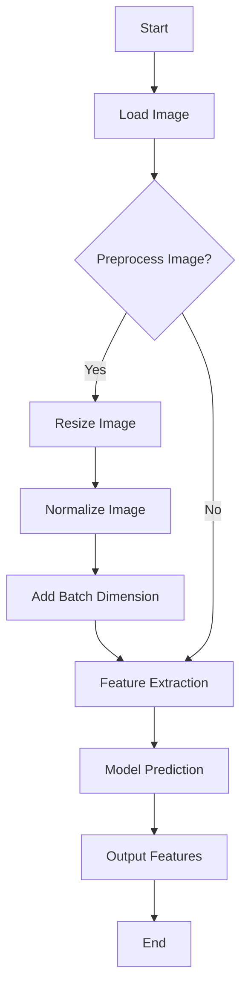
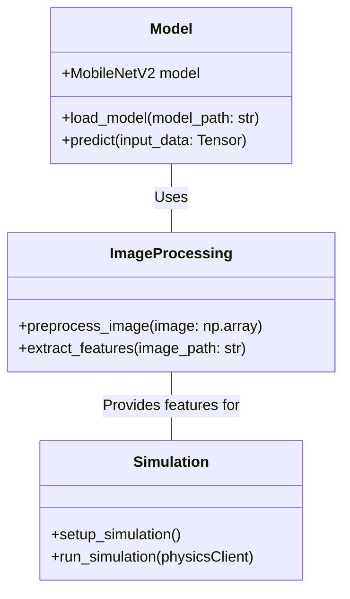

# ML Project


This project uses machine learning for object detection and simulates a robot using PyBullet.

## Installation

Follow these steps to set up the project:

```bash
# Clone the repository
git clone https://github.com/bniladridas/SimuBot.git

# Navigate to the project directory
cd SimuBot

# Install dependencies
pip install -r requirements.txt
```

## Usage

Instructions on how to use the project:

```bash
# Run the simulation
python src/main.py
```

## Project Structure

- `src/`: Contains the source code for the simulation and AI components.
  - `simulation.py`: Sets up and runs the simulation.
  - `ai.py`: Contains the AI model and feature extraction code.
  - `utils.py`: Utility functions for image preprocessing.
  - `main.py`: Main entry point for running the simulation and AI tasks.
- `assets/`: Contains URDF files for the robot and plane.
- `models/`: Contains the pre-trained AI models.
- `img/`: Contains sample images for testing.

## License

This project is licensed under the MIT License - see the [LICENSE](LICENSE) file for details.

## ML Workflow

### Control Flow Diagram

This diagram illustrates the control flow of the ML component for object detection:



### Model and Algorithm Diagram

Here's an overview of the model architecture and algorithms used:



### Explanation

- **Model**: The project leverages a pre-trained MobileNetV2 for object detection, loaded using TensorFlow's Keras API.
- **Image Processing**: Images are preprocessed (resized, normalized) before being fed into the model for feature extraction.
- **Simulation**: The extracted features could guide actions within the PyBullet simulation environment, simulating real-world scenarios where object detection informs robot behavior.